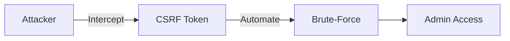

# 🔐 Bypassing CSRF Protection: Bruteforcing DVWA's "Impossible" Login

**Successfully brute-forced DVWA's highest security tier** by automating CSRF token extraction—demonstrating how missing rate-limiting and CAPTCHA render token-based defenses ineffective against determined attackers.

👉 **Key Takeaway**: _"Security is only as strong as its weakest link. CSRF tokens alone won’t stop brute-forcing without layered defenses."_

## 💼 Business Impact  

| Risk | Consequence | Mitigation Cost |  
|------|-------------|----------------|  
| Admin Account Takeover | $500K+ breach risk | Low (CAPTCHA + rate-limiting) |  

## ⚠️ Key Findings  

- CSRF tokens alone failed under automated attacks.  
- **Exploit Time**: <5 minutes with $10 cloud tools.

---

## 🎯 **Why This Matters**

- **Real-World Impact**: Attackers could compromise admin accounts in minutes despite "Impossible" security settings.
    
- **CVSS 8.2** (High Risk): Combines _low attack complexity_ with _high impact_ (privilege escalation).
    
- **Defensive Lessons**: Exposes critical gaps in token-only authentication.
    

---

## ⚡ **Exploit Summary**

|Target|DVWA Login (`Impossible` level)|
|---|---|
|**Vulnerability**|CSRF token rotation without rate-limiting/CAPTCHA|
|**Tools**|Burp Suite, Wireshark, SecLists|
|**Technique**|Automated token extraction + Pitchfork attack|
|**Result**|Compromised `admin:password` in 1,041 requests|

---

## 🔧 **How It Works**

1. **Token Extraction**:
    
    - Used Burp’s **Grep-Extract** to dynamically capture `user_token` from each HTTP response.
        
2. **Brute-Force Automation**:
    
    - Synced tokens with passwords via **Pitchfork attack**, bypassing CSRF checks.
        
3. **Success Detection**:
    
    - Flagged HTTP `200 OK` responses lacking `"Login failed"` errors.
        

[https://payload1.png](https://payload1.png/) _Token/password synchronization in Burp Suite_

---

## 🔬 **Forensic Proof**

- **Wireshark Analysis**: Verified token rotation and successful session hijacking ([see packet 6297](https://wireshark_intercept_specific.png/)).
    
- **Response Metrics**:
    
    - Failed attempts: `Login failed` (1,040×).
        
    - Success: `HTTP 200` + 1,132-byte response (admin dashboard).
        

---

## 🛡️ **Defensive Recommendations**

|Priority|Fix|Why It Works|
|---|---|---|
|**HIGH**|Rate-limiting (e.g., 5 attempts/minute)|Blocks automation|
|**HIGH**|CAPTCHA|Deters bots|
|**MED**|Invalidate tokens after use|Prevents replay|
|**LOW**|Generic error messages|Obscures feedback|

---

## 📂 **Repository Contents**

- `Bruteforce.md`: Full technical walkthrough
    
- `screenshots/`: Annotated Burp/Wireshark proofs
    
- `wordlists/`: Default credentials used
    

---

## 👨‍💻 **Author**

**Pietro Olivieri** | Red Team Analyst | LinkedIn | GitHub

**🚀 Next Project**: _"Bypassing 2FA with Session Hijacking"_ (Coming Soon)